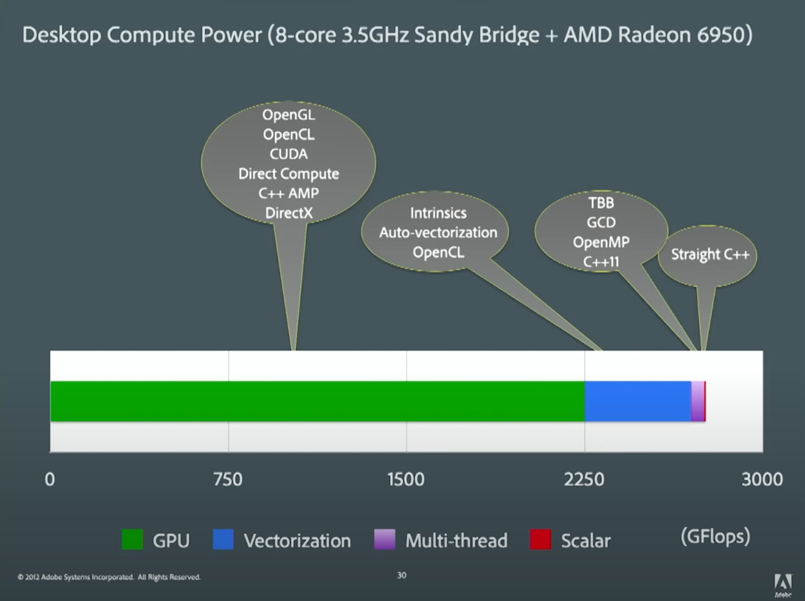

# CUDA

# install
https://docs.nvidia.com/cuda/cuda-installation-guide-linux/index.html
https://nvidia.github.io/cuda-python/overview.html

# notes

<https://youtu.be/kZCPURMH744?t=2853>

<https://docs.nvidia.com/cuda/cuda-c-programming-guide/index.html>
